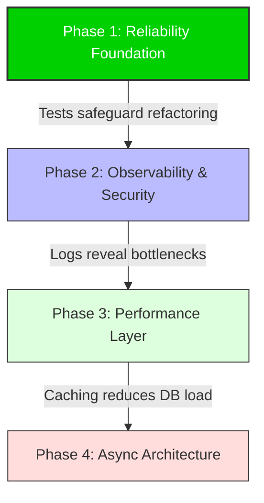

# Phase 1+: Multi-Stage Engineering Roadmap

## 1. Execution Order Dependency Graph

This roadmap is structured to prioritize **Reliability** and **Observability** before **Optimization**. We cannot optimize what we cannot measure, and we cannot refactor what we cannot test.

### Justification

1. **Phase 1 (Testing):** The system currently has NO structured tests. Any change carries a high risk of regression. We must build a safety net first.
2. **Phase 2 (Observability):** Once tests ensure safety, we need structured logs to understand _production_ behavior and identify true bottlenecks before optimizing blindly.
3. **Phase 3 (Performance):** With metrics in hand, we introduce Redis caching to solve specific read-heavy load issues.
4. **Phase 4 (Async):** Finally, we decouple heavy write operations (fines, notifications) into queues for ultimate scalability.

---

## 2. Phase 1: Reliability Foundation (Test Harness)

**Status:** ✅ COMPLETED
**Priority:** CRITICAL

### A. Objective

Establish a robust testing framework to validate business logic and prevent regressions. Focus on "Integration Tests" that verify the API contract and critical transaction flows.

### B. Architectural Rationale

- **Confidence:** Enables aggressive refactoring without fear of breaking core features.
- **Documentation:** Tests serve as living documentation of expected behavior.
- **Bug Prevention:** Catches edge cases (e.g., race conditions in borrowing) before production.

### C. Implementation Details (Executed)

#### **1. Tech Stack**

- **Framework:** `Jest` (Standard, fast, built-in coverage)
- **HTTP Assertions:** `Supertest` (Tests API endpoints directly)
- **Database:** `mongodb-memory-server` (Isolated, fast, ephemeral DB for every test run, running as Replica Set for transactions)

#### **2. Artifacts Produced**

- **Test Suite:** `tests/integration/` and `tests/unit/`.
- **Documentation:** [`docs/TESTING_PLAYBOOK.md`](./TESTING_PLAYBOOK.md) (Developer guide).
- **Report:** [`docs/PHASE_1_REPORT.md`](./PHASE_1_REPORT.md) (Coverage & Risk analysis).

#### **3. Key Scenarios Covered**

- **Happy Path:** User creates account, searches book, borrows book, returns book.
- **Edge Cases:** Borrowing unavailable book, borrowing past limit, returning already returned book.
- **Transactions:** Validated DB rollback if `borrowBook` fails halfway using `MongoMemoryReplSet`.

### D. Replication Guide

See [`docs/TESTING_PLAYBOOK.md`](./TESTING_PLAYBOOK.md) for full instructions.

---

## 3. Phase 2: Observability & Security

**Status:** Planned (Frozen until authorized)

### A. Objective

- Replace `console.log` and `morgan` with structured JSON logging and implement protection against abuse.

### B. Architectural Rationale

- **Structured Logs:** `console.log` is unsearchable in production tools (Datadog/ELK). JSON logs allow querying by `requestId`, `userId`, or `error.code`.
- **Rate Limiting:** Prevents denial-of-service (DoS) attacks and brute-force attempts.

### C. Implementation Plan

- **Library:** `winston` or `pino` for logging. `express-rate-limit` for throttling.
- **Middleware:** Create `requestLogger` middleware to tag every request with a UUID.
- **Config:** Set stricter limits for POST /login and POST /users.

---

## 4. Phase 3: Performance Layer (Caching)

**Status:** Planned (Frozen until authorized)

### A. Objective

Reduce database load for read-heavy endpoints (`GET /books`, `GET /books/search`).

### B. Architectural Rationale

- **Read/Write Ratio:** Library systems are read-heavy (many searches, few borrows).
- **Latency:** Serving metadata from RAM (Redis) is O(1) compared to MongoDB's O(log n) + network IO.

### C. Implementation Plan

- **Stack:** Redis (via `ioredis`).
- **Strategy:** Cache-Aside.
  - Check Cache -> If Miss, Query DB -> Write to Cache (TTL: 1 hour).
  - Invalidate Cache on `createBook` or `updateBook`.

---

## 5. Phase 4: Async Architecture (Queues)

**Status:** Planned (Frozen until authorized)

### A. Objective

Decouple time-consuming background tasks from the main request-response cycle.

### B. Architectural Rationale

- **Responsiveness:** The user shouldn't wait for an email to send before getting a "Book Borrowed" response.
- **Reliability:** If the Email Service is down, the job retries later without failing the user's request.

### C. Implementation Plan

- **Stack:** `BullMQ` (Redis-based).
- **Workers:**
  - `email-worker`: Sends confirmations.
  - `fine-worker`: Nightly job to calculate overdue fines.
