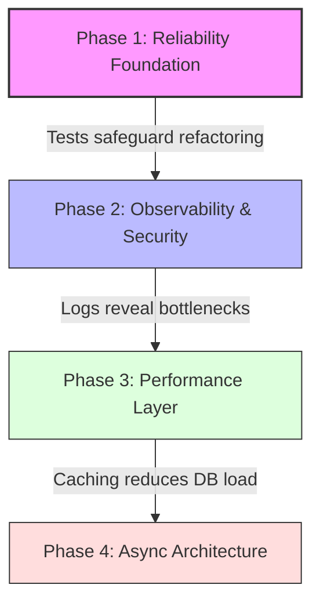

# Phase 1+: Multi-Stage Engineering Roadmap

## 1. Execution Order Dependency Graph

This roadmap is structured to prioritize **Reliability** and **Observability** before **Optimization**. We cannot optimize what we cannot measure, and we cannot refactor what we cannot test.



### Justification
1.  **Phase 1 (Testing):** The system currently has NO structured tests. Any change carries a high risk of regression. We must build a safety net first.
2.  **Phase 2 (Observability):** Once tests ensure safety, we need structured logs to understand *production* behavior and identify true bottlenecks before optimizing blindly.
3.  **Phase 3 (Performance):** With metrics in hand, we introduce Redis caching to solve specific read-heavy load issues.
4.  **Phase 4 (Async):** Finally, we decouple heavy write operations (fines, notifications) into queues for ultimate scalability.

---

## 2. Phase 1: Reliability Foundation (Test Harness)
**Status:** 🚧 Pending Implementation
**Priority:** CRITICAL

### A. Objective
Establish a robust testing framework to validate business logic and prevent regressions. Focus on "Integration Tests" that verify the API contract and critical transaction flows.

### B. Architectural Rationale
*   **Confidence:** Enables aggressive refactoring without fear of breaking core features.
*   **Documentation:** Tests serve as living documentation of expected behavior.
*   **Bug Prevention:** Catches edge cases (e.g., race conditions in borrowing) before production.

### C. Detailed Implementation Plan
**1. Tech Stack Selection**
*   **Framework:** `Jest` (Standard, fast, built-in coverage)
*   **HTTP Assertions:** `Supertest` (Tests API endpoints directly)
*   **Database:** `mongodb-memory-server` (Isolated, fast, ephemeral DB for every test run)

**2. Directory Structure**
```text
tests/
├── integration/          # API Route -> Controller -> Service -> DB
│   ├── auth.test.js
│   ├── books.test.js
│   └── borrowing.test.js # Critical transaction tests
├── unit/                 # Isolated Service logic
│   └── fineCalculation.test.js
├── setup.js              # Global test setup (Connect to in-memory DB)
└── tearDown.js           # Cleanup
```

**3. Key Scenarios to Cover**
*   **Happy Path:** User creates account, searches book, borrows book, returns book.
*   **Edge Cases:** Borrowing unavailable book, borrowing past limit, returning already returned book.
*   **Transactions:** Ensure DB rollback if `borrowBook` fails halfway.

### D. Replication Guide (Developer Playbook)
1.  **Install Dependencies:**
    ```bash
    npm install --save-dev jest supertest mongodb-memory-server cross-env
    ```
2.  **Configure Environment:**
    Update `package.json` scripts:
    ```json
    "test": "cross-env NODE_ENV=test jest --runInBand",
    "test:watch": "cross-env NODE_ENV=test jest --watch",
    "test:coverage": "cross-env NODE_ENV=test jest --coverage"
    ```
3.  **Run Tests:**
    ```bash
    npm test
    ```

---

## 3. Phase 2: Observability & Security
**Status:** Planned

### A. Objective
Replace `console.log` and `morgan` with structured JSON logging and implement protection against abuse.

### B. Architectural Rationale
*   **Structured Logs:** `console.log` is unsearchable in production tools (Datadog/ELK). JSON logs allow querying by `requestId`, `userId`, or `error.code`.
*   **Rate Limiting:** Prevents denial-of-service (DoS) attacks and brute-force attempts.

### C. Implementation Plan
*   **Library:** `winston` or `pino` for logging. `express-rate-limit` for throttling.
*   **Middleware:** Create `requestLogger` middleware to tag every request with a UUID.
*   **Config:** Set stricter limits for POST /login and POST /users.

---

## 4. Phase 3: Performance Layer (Caching)
**Status:** Planned

### A. Objective
Reduce database load for read-heavy endpoints (`GET /books`, `GET /books/search`).

### B. Architectural Rationale
*   **Read/Write Ratio:** Library systems are read-heavy (many searches, few borrows).
*   **Latency:** Serving metadata from RAM (Redis) is O(1) compared to MongoDB's O(log n) + network IO.

### C. Implementation Plan
*   **Stack:** Redis (via `ioredis`).
*   **Strategy:** Cache-Aside.
    *   Check Cache -> If Miss, Query DB -> Write to Cache (TTL: 1 hour).
    *   Invalidate Cache on `createBook` or `updateBook`.

---

## 5. Phase 4: Async Architecture (Queues)
**Status:** Planned

### A. Objective
Decouple time-consuming background tasks from the main request-response cycle.

### B. Architectural Rationale
*   **Responsiveness:** The user shouldn't wait for an email to send before getting a "Book Borrowed" response.
*   **Reliability:** If the Email Service is down, the job retries later without failing the user's request.

### C. Implementation Plan
*   **Stack:** `BullMQ` (Redis-based).
*   **Workers:**
    *   `email-worker`: Sends confirmations.
    *   `fine-worker`: Nightly job to calculate overdue fines.
