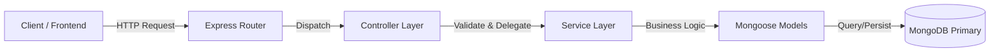

# Phase 0: System Blueprint & Living Documentation

## 1. Current-State Architecture Map

The Book Library API is designed as a **Layered Monolith** following the Separation of Concerns principle. The architecture enforces a strict unidirectional flow of data and control.

### High-Level Architecture

### Request Lifecycle
1.  **Incoming Request:** Client sends HTTP request (e.g., `POST /api/borrow`).
2.  **Middleware Chain:**
    *   `Helmet` (Security Headers)
    *   `Cors` (Cross-Origin Resource Sharing)
    *   `Morgan` (HTTP Logging)
    *   `BodyParser` (JSON parsing)
3.  **Router (`src/routes/`):** Matches URL/Method to a specific route handler.
    *   Executes `express-validator` middleware rules.
    *   Executes `handleValidationErrors` to check for validation failures.
4.  **Controller (`src/controllers/`):**
    *   Extracts data from `req.body` or `req.params`.
    *   Invokes the appropriate method in the Service layer.
    *   Handles success responses (HTTP 200/201) and formatting.
    *   Catches errors and passes them to the global error handler (`next(err)`).
5.  **Service (`src/services/`):**
    *   Contains **ALL** business logic.
    *   Performs complex validations (e.g., "Is user active?", "Is book available?").
    *   Orchestrates database operations (e.g., Transactions).
    *   interacts with Mongoose Models.
6.  **Model (`src/models/`):**
    *   Defines Schema structure and data types.
    *   Contains Logic-near-data: Virtuals, Pre-save hooks, Static helper methods.
7.  **Database:** MongoDB stores the persistent state.

---

## 2. Core Domains & Interactions

### User Domain (`User.js`)
*   **Role:** Represents a library member.
*   **Key Responsibilities:**
    *   Stores profile info (Name, Email, Phone).
    *   Tracks membership status (`active`, `suspended`).
    *   **Interaction:** Referenced by `BorrowRecord` to track who has what book.

### Book Domain (`Book.js`)
*   **Role:** Represents a physical inventory item.
*   **Key Responsibilities:**
    *   Stores metadata (Title, ISBN, Genre).
    *   Tracks availability status (`available: boolean`).
    *   **Interaction:** Referenced by `BorrowRecord`; Links to `Author`.

### Author Domain (`Author.js`)
*   **Role:** Represents the creator of a book.
*   **Key Responsibilities:**
    *   Stores biographical data.
    *   **Interaction:** Parent entity to `Book`.

### BorrowRecord Domain (`BorrowRecord.js`)
*   **Role:** The "Join Table" or "Transaction Ledger".
*   **Key Responsibilities:**
    *   Links `User` and `Book`.
    *   Tracks lifecycle: `active` -> `returned` / `overdue` / `lost`.
    *   Calculates Fines (via virtuals and hooks).
    *   Enforces Due Dates.

---

## 3. Transaction Flows

### A. The `borrowBook` Transaction
**Location:** `src/services/borrowService.js` -> `borrowBook()`
**Criticality:** High. Must prevent race conditions (two users borrowing the last copy).

**Step-by-Step Flow:**
1.  **Validation (Reads):**
    *   Check if User exists and is `active`.
    *   Check User's borrow limit (`user.canBorrow()`).
    *   Check if Book exists and is `available`.
    *   Check for duplicate active borrows of the same book by the user.
2.  **Execution (Write - Transactional):**
    *   **Start MongoDB Session & Transaction.**
    *   **Action 1:** Create new `BorrowRecord` with status `active` and calculated `dueDate`.
    *   **Action 2:** Update `Book` document: set `available = false`.
    *   **Commit Transaction.**
3.  **Completion:** Return the populated BorrowRecord.
4.  **Error Handling:** If any step fails, `abortTransaction()` rolls back all changes.

### B. The `returnBook` Transaction
**Location:** `src/services/borrowService.js` -> `returnBook()`

**Step-by-Step Flow:**
1.  **Validation:**
    *   Check if BorrowRecord exists.
    *   Ensure it's not already `returned`.
2.  **Execution (Write - Transactional):**
    *   **Start MongoDB Session & Transaction.**
    *   **Action 1:** Update `BorrowRecord`: set `status = 'returned'`, `returnDate = now`.
    *   **Action 2:** Update `Book` document: set `available = true`.
    *   **Commit Transaction.**
3.  **Post-Process (Hook):** `pre('save')` hook in `BorrowRecord` handles internal consistency.

---

## 4. Business Rules Location Map

| Business Rule | Implementation Location | Reasoning |
| :--- | :--- | :--- |
| **Input Format Validation** | `src/middleware/validation.js` | Fail fast before hitting logic. |
| **Duplicate Email/ISBN** | `src/models/*.js` (Unique Index) | Database-level integrity guarantee. |
| **Max Borrow Limit (5)** | `src/models/User.js` (`canBorrow`) | Logic specific to User state. |
| **Book Availability Check** | `src/services/borrowService.js` | Part of the borrowing transaction flow. |
| **Fine Calculation** | `src/models/BorrowRecord.js` (Virtuals) | Derived data based on state/time. |
| **Default Due Date (14 days)** | `src/models/BorrowRecord.js` (Pre-save) | Default data initialization. |
| **Renewal Limit (Max 3)** | `src/models/BorrowRecord.js` (`renew`) | State transition logic. |
